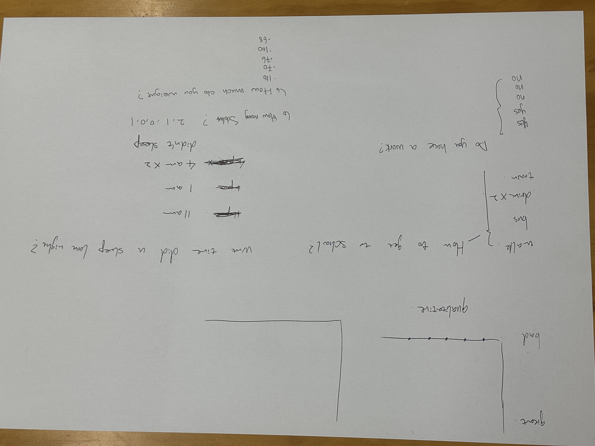
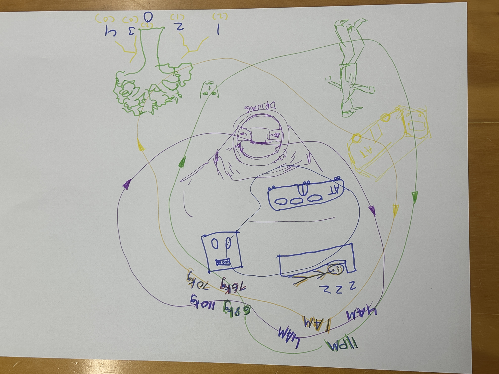
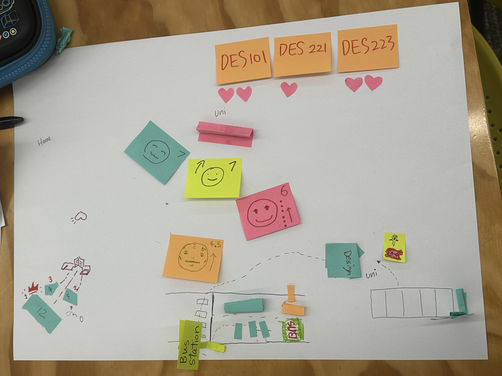
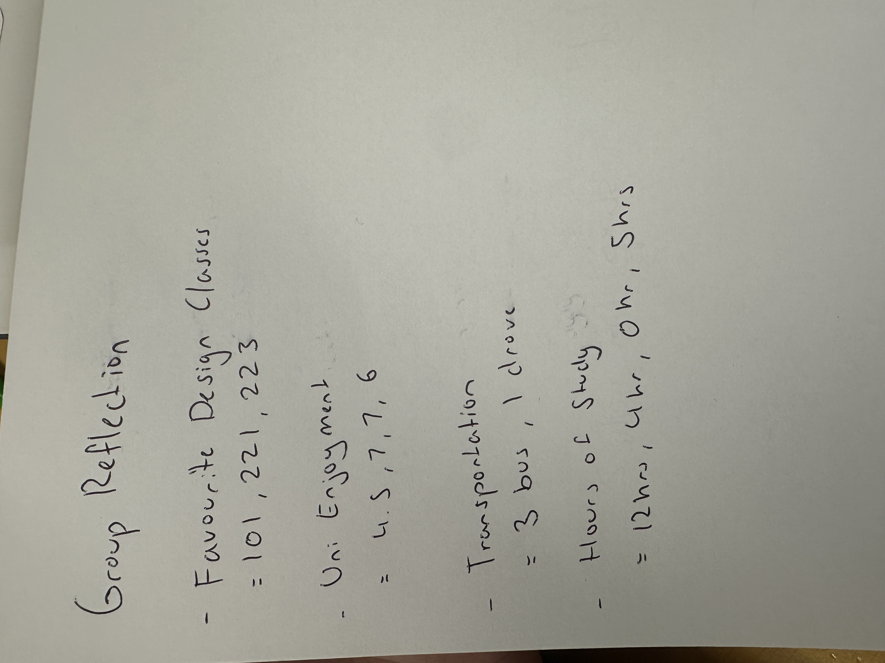

# Week 01

Experiment 1 – Data Drawings

Group Data Portrait

Overview

In this experiment, our group explored how personal data can be shown through hand drawing. The goal was to create a “group data portrait”. Instead of using names, we used data to represent the people in our group. This helped us think about how everyday information can tell a story about a person.

Data Collection

Our group had five members. We created a short questionnaire and asked each other several questions. The questions included body weight, transportation to university, whether we have siblings, whether we currently have a job, and what time we usually go to sleep.

Each person wrote their answers on post-it notes. The notes were anonymous, so no names were used. This made the data more interesting, because we focused on the information rather than the person.

Visualisation

After collecting the data, we worked together to draw a visualisation on a sheet of paper. We used colours, arrows, drawings and symbols to represent different types of data.
For example, transportation was shown using drawings such as buses or walking figures. Sleep time and weight were written next to simple character drawings. We placed different elements around the page to show daily routines such as sleeping, studying, and travelling to university.
Instead of using charts or graphs, we created our own visual language. This allowed us to express the data in a more creative and playful way.

Decoding Another Group

After finishing our drawing, we exchanged our data portrait with another group. We tried to understand the information shown in their visualisation.

From their drawing, we could see some patterns. For example, several people travelled by bus, and one person drove. They also showed favourite design classes, enjoyment of university, and hours of study.
However, it was hard to know which data belonged to which person. This showed how data can still communicate patterns even when identities are hidden.

Reflection

This activity helped me see that data visualisation can be creative and personal. We usually think about data as numbers in charts or spreadsheets. In this exercise, we used drawings and symbols instead.
One challenge was making the visual language clear. Some symbols were easy to understand, while others were more confusing. This made me realise that the design of a visual system is very important.
This experiment also relates to the idea of data humanism. Data does not always have to be perfect or precise. It can also show human experiences and everyday life. Our drawing showed small details about our routines, such as sleeping habits and transportation.

Overall, this activity showed that data can be expressive, personal, and open to interpretation.