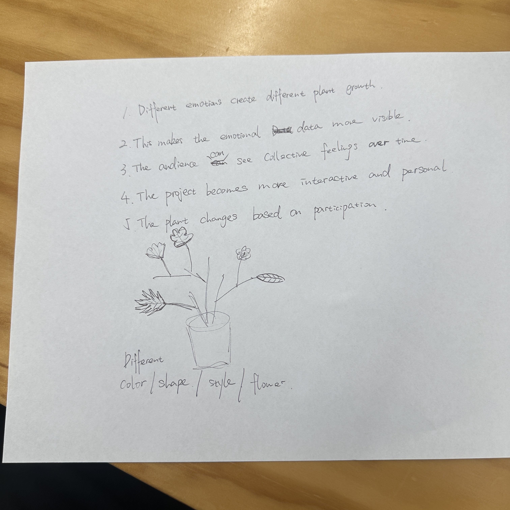

# Week 08

[← Back to Home](../index.md)

## In-Class Activities

### Progress Report

This week I presented the current progress of my emotion data visualisation project to a small group in class.

At this stage, my project focused on visualising long-term emotional patterns across four weeks. The prototype used a grid layout to organise emotions by week, day, and time period. Each day was divided into morning, afternoon, and night.

The main emotional categories were:

- Happy
- Calm
- Stress
- Sad
- Tired

Each emotion was represented using a different colour. The purpose of the project was to help users recognise repeated emotional patterns and reflect on their emotional wellbeing over time.

---

## Feedback Received

During the group discussion, I received feedback about how the project could represent emotions in more expressive ways.

One suggestion was to explore different approaches to the website, such as using sound, movement, or moving objects to communicate emotional states.

Another suggestion was to design an emotion creature or avatar. Instead of only showing emotions through coloured circles, the current emotional state could influence the creature’s appearance and behaviour.

Possible features included:

- Body shape
- Posture
- Colour
- Movement
- Texture
- Energy level

For example, a calm emotion could be represented by a round and soft body shape. A sad or tired emotion could appear collapsed or curled. A stressed emotion could use sharper textures or jittery movement.

This feedback helped me think about emotions as dynamic experiences, not only static data points.

---

## Critical Design Proposition

As part of the class activity, I also gave feedback on another student’s project.

Their project explored emotional data and collective participation. I suggested using plant growth as a metaphor for emotional data. Different emotions could create different plant forms, colours, shapes, or flowers.

My suggestion included:

- Different emotions create different plant growth
- Emotional data becomes more visible
- The audience can see collective feelings over time
- The project becomes more interactive and personal
- The plant changes based on participation

This activity helped me think about how emotional data can be visualised through organic and metaphorical forms.

---

## Independent Study

### Reflective Summary

The feedback session was useful because it introduced alternative ways of representing emotions visually.

I found the emotion creature or avatar idea interesting. It could make emotional data feel more personal and expressive. It also showed me that emotions can be communicated through movement, posture, texture, and energy, not only through colour.

However, I decided not to include the creature or avatar system in the current version of my project. My main goal is to help users recognise emotional patterns over time through long-term emotional tracking. I felt that adding a creature design or complex animation system might distract from the core purpose of understanding emotional trends and daily behaviour patterns.

Instead, I decided to continue developing the timeline-based emotional visualisation. I want to focus on improving clarity, usability, and emotional pattern recognition.

This feedback was still valuable because it helped me evaluate my design direction more clearly. It made me think about the difference between expressive emotional representation and clear data visualisation.

---

## Project Development

This week, I continued refining the emotion data visualisation prototype in p5.js.

The main development focus was improving the visual structure and making the emotional patterns easier to understand.

I continued working on:

- Mood filter
- Time filter
- Weekly grid layout
- Emotion colour system
- Mood colour key
- Design purpose statement

The current prototype shows repeated emotional patterns across four weeks. It allows users to compare different days and time periods, such as morning, afternoon, and night.

Through this development, I became more confident that the project should remain focused on emotional tracking and pattern recognition.

---

## What I Learned

This week I learned that feedback does not always need to be directly adopted into the final project. Sometimes feedback helps clarify what the project should not become.

The class discussion helped me understand that my project could move in many different directions. It could become an emotion avatar, an animated creature, a sound-based experience, or an interactive diary.

However, I decided that the most suitable direction for this project is still a long-term emotional tracking system.

I learned that a clear design purpose is important. My project is not only about making emotions look interesting. It is about helping users observe emotional patterns and reflect on their wellbeing.

---

## Next Steps

For the next stage, I want to continue improving the current prototype.

My next steps include:

- Improving the readability of the grid
- Making the filters easier to use
- Adding more detailed emotional records
- Exploring hover interactions
- Considering emotional triggers, such as assignments, work, or rest time

I also want to make the visualisation more useful for users by showing not only what emotion appears, but also when and why it appears.

---